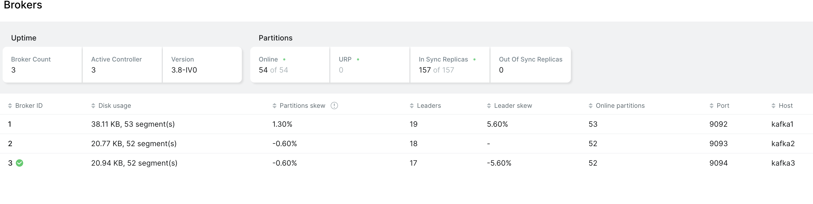
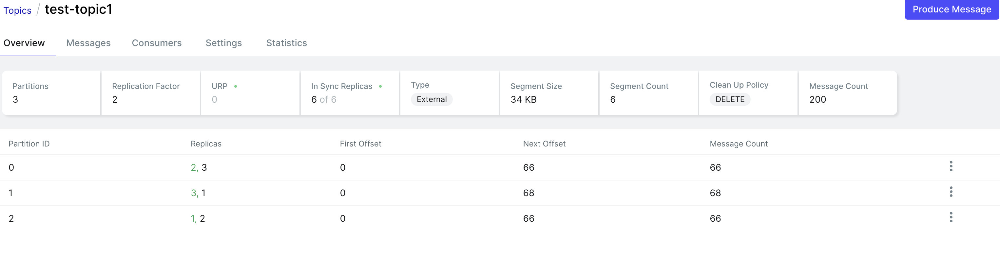
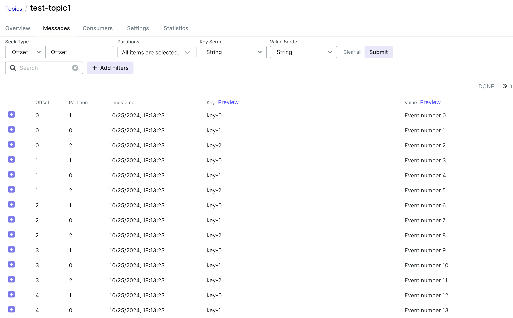

## Overview

1.	Setup Distributed  
	- Database (Cockroach DB)  
	- Cache (Redis)  
	- Event Processing (Kafka) 
2. Codebase: Microservices written in Node.js.
3.	Documentation:
	- Overview of the system architecture (diagrams and explanations).
    - README on how to run the project locally using Docker Compose.
	- Explanation of distributed principles applied: database replication, caching strategies, message queues, and load balancing.

----------------------------------------------------------------
## Requirements
- Node 20
- Docker

## Run the project
```bash
#build and run the containers
docker compose up --build -d

# to delete the containers
docker compose down
```


## UIs

### Cockroach DB UI
- [http://localhost:8080](http://localhost:8080)
- [http://localhost:8081](http://localhost:8081)
- [http://localhost:8082](http://localhost:8082)


### Kafka

[http://localhost:8090](http://localhost:8090)


### Redis
[http://localhost:5540](http://localhost:5540)

In the redis insight dash board add the hosts

| Node  | host  | port  |
|---|---|---|
| Node1  | `distributed-ecom-redis-node1-1`  | 6379  |
| Node2  | `distributed-ecom-redis-node2-1`  | 6380  |
| Node3  | `distributed-ecom-redis-node3-1`  | 6381  |
| Node4  | `distributed-ecom-redis-node4-1`  | 6382  |
| Node5  | `distributed-ecom-redis-node5-1`  | 6383  |
| Node6  | `distributed-ecom-redis-node6-1`  | 6384  |


### Grafana
[http://localhost:3000/login](http://localhost:3000/login)


## Generate Traffic

use the scripts inside `/test` to generate traffic


## Sample Data

### Kafka






### Redis
Redis has slots from 0 to 16383.

```bash
#connect to redis and run command
% cluster slots
```

```bash
172.22.0.3:6379> cluster slots
1) 1) (integer) 0 #slot start
   2) (integer) 5460 # slot end
   3) 1) "172.22.0.3" #IP address of node
      2) (integer) 6379 # port of node
      3) "4658fb1ad7578c3e8843f9ab3de701d4dfc5691f" # node id 
      4) (empty array) # other info of node
   4) 1) "172.22.0.4"  # replica node ip
      2) (integer) 6383 #replica node port
      3) "b03b20a6e2c0905e2ea67b9741ab09f2a994062c" # replica nodeid
      4) (empty array)
2) 1) (integer) 5461
   2) (integer) 10922
   3) 1) "172.22.0.14"
      2) (integer) 6380
      3) "eae3d9179b5938c6c2a873f2738fc30a73d0f0ae"
      4) (empty array)
   4) 1) "172.22.0.9"
      2) (integer) 6384
      3) "da07bf3599a4b5847ea38d8b28d828c6ef92da1b"
      4) (empty array)
3) 1) (integer) 10923
   2) (integer) 16383
   3) 1) "172.22.0.6"
      2) (integer) 6381
      3) "42a94dedfb760223fbeed0e7723707d4dd77ddfc"
      4) (empty array)
   4) 1) "172.22.0.8"
      2) (integer) 6382
      3) "e7c60f8f19042778870f8a2a5aa493c1ec320ca2"
      4) (empty array)
```

- Slots 0-5460 -> node1
- Slots 5461-10922 -> node2
- Slots 10923-16383 -> node3


#### Adding key to redis


1. Added a key `test1`,
2. redis uses CRC16 algorithm to generate hash 16bit hash
3. Next we compute the hashslot by using module 16,384
4. And the key added to corresponding node

Ex:
```python
import binascii

def calculate_hash_slot(key):
    # Calculate CRC16 checksum of the key
    crc16_value = binascii.crc_hqx(key.encode('utf-8'), 0)
	#crc16_value  = 4768
    # Calculate the hash slot by taking modulus with 16384
    hash_slot = crc16_value % 16384
	#hashslot = 4768%16384 = 4768
    return hash_slot

# Example with 'test1'
key = 'test1'
hash_slot = calculate_hash_slot(key)
print(f"Hash Slot for '{key}': {hash_slot}")
```

Lets check it in terminal

```bash
cluster keyslot test1
```

```shell
% cluster slots
```


Lets check it in explorer


#### Redis hot key handling
1. Key sharding
in above example assume `test1` is a hot key which is inserted in node1.
To distribute load, we can append a random number to key to distribute the key to multiple nodes.

Eg:-
```
crc16(test1:0)%16384 = 3318  => node1
crc16(test1:1)%16384 = 7383  => node2
crc16(test1:2)%16384 = 11444 => node3
```
